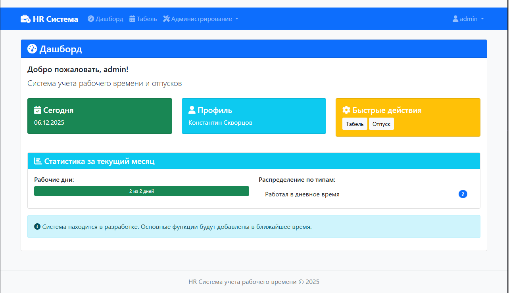
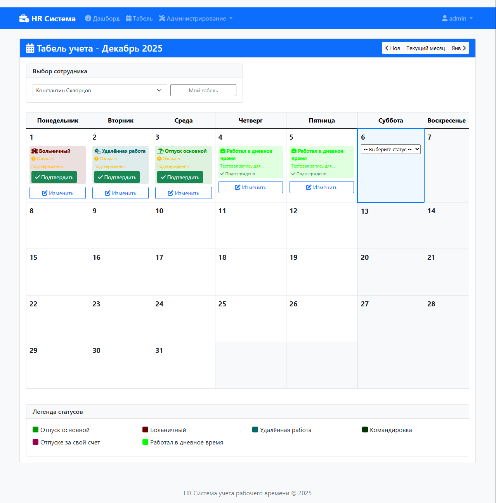
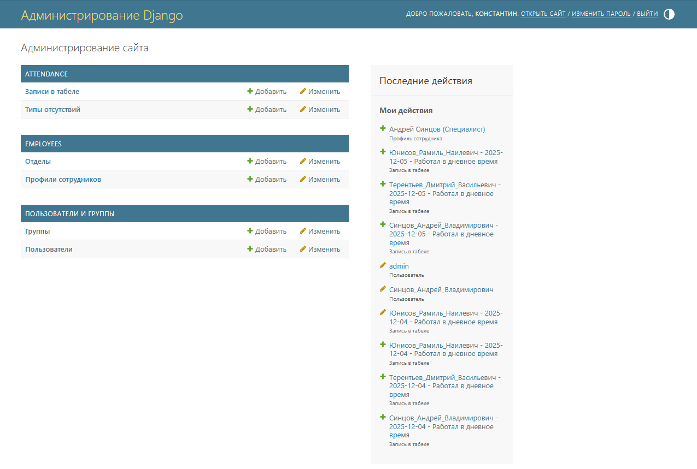

# HR Система учёта рабочего времени

Удобная система для ведения табеля, подтверждения записей и управления сотрудниками.  
Подходит для малых и средних компаний. Построена на Django + Bootstrap 5.

## 🖼️ Скриншоты интерфейса

### 1. Дашборд

## 🖼️ Скриншоты интерфейса

### 1. Дашборд руководителя


### 2. Календарь табеля (месяц)


### 3. Меню администратора



## 🌟 Функционал

- 🗓️ **Табель по дням** — цветные статусы (работа, отпуск, больничный)
- ✅ **Подтверждение записей** — руководитель подтверждает отсутствие
- 👥 **Управление сотрудниками** — иерархия, должности, подчинённые
- 🔐 **Роли**: сотрудник, руководитель, администратор
- 🎨 **Адаптивный интерфейс** — работает на ПК и планшетах

## 📁 Структура проекта
hr-system-project/
├── attendance/ → учёт посещаемости
├── employees/ → данные сотрудников
├── hr_system/ → настройки Django
├── templates/ → HTML-шаблоны
├── docs/ → документация
├── manage.py
├── requirements.txt
└── db.sqlite3 → база данных (локальная)


## 🚀 Запуск

# 1. Активируйте виртуальное окружение:
   ```bash
   venv\Scripts\activate
   
2. Установите зависимости:
bash
pip install -r requirements.txt
#3. Примените миграции:
bash
python manage.py migrate
# 4. Создайте суперпользователя:
bash
python manage.py createsuperuser
# 5. Запустите сервер:
bash
python manage.py runserver

→ Откройте: http://127.0.0.1:8000

## 📚 Документация
Архитектура
FAQ
Функции
Установка
Текущий статус

🛠️ Технологии
Python 3.13
Django 5.1
Bootstrap 5
Font Awesome 6
SQLite (для разработки)

## 📂 Лицензия
MIT — можно использовать в коммерческих целях.

